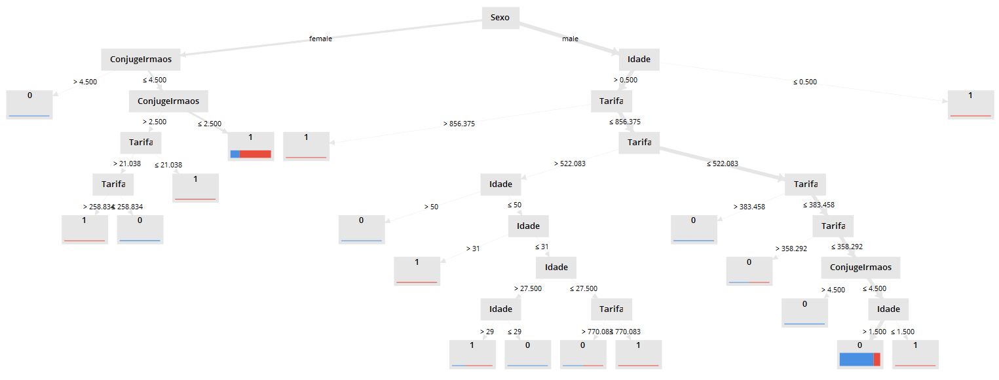

# Trabalho da Disciplina Fundamentos de BI

**Aluno:** Eduardo Koerich d'Ávila

**Data:** 05/12/2018

## Trabalho Prático - Predição do Destino dos Passageiros a Bordo do Titanic

### 1. Criação do processo passo-a-passo ###

1. Transformação do campo **Tarifa** de uma valor textual para um valor numérico (real). Aqui, considerei
o caractere "." como separador das casas decimais. Como alguns valores possuíam mais de um separador decimal,
eu os considerei como inexistentes para tratá-los na etapa seguinte.

2. Preenchimento dos valores inexistentes dos campos **Idade**  e **Tarifa** com seus valores médios e
preenchimento dos valores inexistente do campo **PortaoEmbarque** com seu valor mais recorrente, que no caso,
foi "S".

3. Extração do sobrenome a partir do campo **NomePessoa** e o inclusão do mesmo em um novo campo, chamado
**Sobrenome**. Realizei este procedimento durante a construção do processo para verificar se o sobrenome
possuía algum peso na questão da sobrevivência, para averiguar se pessoas de família mais nobre poderiam
ter mais chances de sobrevivência. Posteriormente, verifiquei que não, mas mantive o campo no conjunto de
dados para demonstrar a evolução da construção do processo final.

4. Atribuição do papel *label* ao campo **Sobrevivente**, para que seja utilizado no ensino dos modelos
preditivos e posterior classificação dos dados não classificados.

5. Remoção dos campos **IDPessoa**, **Cabina**, **NomePessoa** e **NumTicket** do conjunto de dados
utilizados para treinar o modelo preditivo, por não possuírem relevância no treinamento.

6. Atribuição de peso aos campos restantes, para posterior seleção dos campos relevantes pelo seu peso.
Utilizei o componente *Weight by Information Gain Ratio* para evitar distorções em relação aos campos que
contém uma quantidade muito grande de valores distintos.

7. Seleção dos quatro campos mais relevantes para utilização no treinamento dos modelos preditivos. Os
campos selecionados aqui foram **Sexo**, **Idade**, **Tarifa**, **ConjugeIrmaos**.

8. Multiplicação dos dados de entrada dos modelos para inserção nos diferentes tipos de modelos, para
cálculo de suas performances e curva ROC.

9. Teste de validação cruzada nos diferentes modelos de predição, para determinar sua performance e
efetuar um teste de significância dos mesmos.

10. Criação da curva de ROC utilizando dos mesmos modelos de predição utilizados nos testes de performance,
com os mesmos valores em seus parâmetros, para verificar a taxa de falsos positivos do modelo.

11. Tratamento dos dados não classificados para posterior aplicação do modelo de classificação dos dados:
transformação do campo **Tarifa** em número, substituição de valores inexistentes, extração do sobrenome e
atribuição do papel *id* ao campo **IDPessoa**.

12. Aplicação do modelo selecionado, que no caso foi o modelo de Árvore de Decisão, nos dados não classificados,
para classificá-los e mostrar se um determinado passageiro sobreviveu ou não ao naufrágio do Titanic, bem como
as chances desta hipótese ser verdadeira.

### 2. Imagens Adicionais ###

#### Peso dos Campos ####

#### Performance dos Modelos ####

#### ROC dos Modelos ####

#### Árvore de Decisão ####

